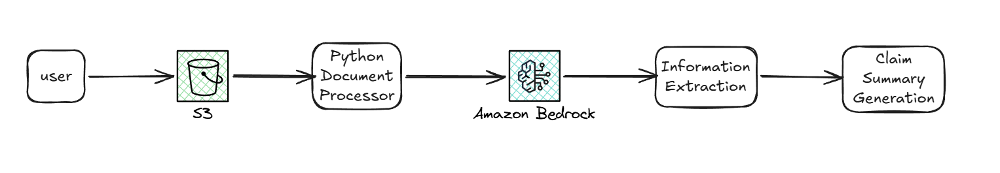

# AI Insurance Claim Document Processor

Proof-of-concept system that automates the processing of insurance claim documents using foundation models from Amazon Bedrock.

The solution extracts structured information from claim documents and generates concise summaries, reducing manual processing effort and improving consistency.

## Project Overview

Insurance companies process large volumes of claim documents that contain important information such as claimant details, policy numbers, incident descriptions, and claim amounts.

Manually reviewing these documents is time-consuming and prone to inconsistencies.

This project demonstrates a document processing pipeline powered by generative AI, capable of:

- Extracting structured information from claim documents
- Generating concise summaries
- Comparing performance of different foundation models
- Organizing reusable components for AI applications

## Architecture

The system follows a simple AI processing workflow:

- Amazon S3 — document storage
- Amazon Bedrock — foundation model inference
- Python — processing logic using boto3

## Features

- Document ingestion from cloud storage
- Automated information extraction using LLMs
- AI-generated claim summaries
- Prompt template management
- Reusable model invocation component
- JSON validation for structured outputs
- Model performance comparison

## Example Claim Document
Claimant Name: John Smith  
Policy Number: POL-123456  
Incident Date: 2025-01-10  
Claim Amount: $4500  

Incident Description:  
Vehicle accident resulting in front bumper and headlight damage.  
Repair costs estimated at $4500.  

## Example Output
{  
  "Claimant Name": "John Smith",  
  "Policy Number": "POL-123456",  
  "Incident Date": "2025-01-10",  
  "Claim Amount": "$4500",  
  "Incident Description": "Vehicle accident with damage to front bumper and headlights."  
}  

## Generated Summary
The claim involves a vehicle accident that occurred on January 10, 2025.
The claimant reported damage to the front bumper and headlights, with
estimated repair costs of $4500.

## Models Evaluated

The project compares models available through Amazon Bedrock.

| Model | Response Time | Quality |
|:------|:-------------:|------:|
| Claude 3 Haiku | 1.2s | Good |
| Claude 3 Sonnet | 2.8s | Very Good | 

**Observations**  
- Haiku provides faster responses and lower cost.
- Sonnet produces slightly more detailed summaries.
- Both models performed well for structured information extraction.

## Learning Outcomes

This project demonstrates practical skills in:
- Building AI-powered document processing workflows
- Integrating foundation models using AWS
- Designing reusable AI components
- Prompt engineering and output validation
- Evaluating model performance